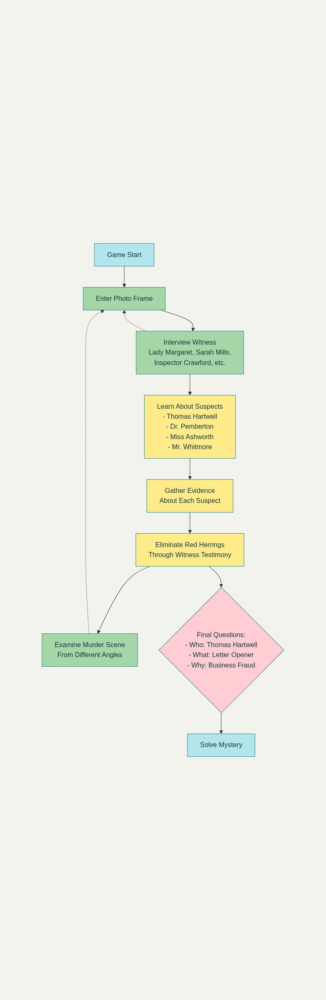

# Game Loop & Player Introduction

## Opening - The Detective's Portrait Awakens

*You are Inspector Reginald Crawford (retired), whose portrait hangs in Blackwood Manor. Every night, when the mansion sleeps, the portraits come alive. But this morning is different...*

### The Inspector's Morning Discovery

"What's that smell... blood? And why is the morning light so harsh today?

Wait... Lord Blackwood's body! There, by the corner table!

The other portraits are stirring. They witnessed last night's events while I slept. If I can jump between their frames and gather testimonies, perhaps I can solve one final case.

Lady Margaret looks shaken. I should start there."

### Character Background

You are **Inspector Reginald Crawford**, retired from Scotland Yard after 20 years of service. Lord Blackwood commissioned your portrait five years ago to honor your help in a delicate family matter. Now, even in portrait form, your detective instincts remain sharp.

Your unique ability to leap between portrait frames will let you:
- Interview each witness from their perspective
- See the crime scene from multiple angles  
- Piece together what happened in the crucial minutes around 11:30 PM

---

## Core Gameplay Loop

1. **Wake up** → Discover the crime
2. **Jump between frames** → New viewpoint + witness testimony  
3. **Examine environment** → Find clues only visible from certain angles
4. **Connect evidence** → Link testimonies with physical clues
5. **Solve the case** → Answer the three questions

## Victory Condition

Correctly identify:
- Who did it? (Thomas Hartwell)
- What weapon? (Ornate letter opener)
- Why? (£50,000 embezzlement)

